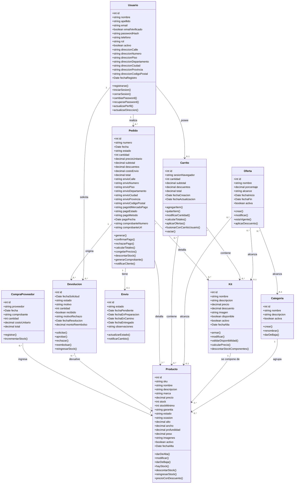

# Aventura 360 — Diagrama de clases (entidades)

Modelo de entidades del dominio, derivado de [Aventura360-Requerimientos-v1.0.pdf](Aventura360-Requerimientos-v1.0.pdf).

Criterio: sin separar por responsabilidades, sin normalizar y solo con entidades del negocio. Los atributos compuestos quedan dentro de su clase y no se modelan clases intermedias ni de infraestructura.

---

## Diagrama

---

## Las clases

### Usuario

Un único registro para los dos métodos de acceso (RF08, UC30): `passwordHash` queda vacío cuando la cuenta se creó con Google, y el correo verificado unifica la identidad.

| Atributo | Descripción | Trazabilidad |
|---|---|---|
| `email`, `emailVerificado` | La cuenta no confirma compras sin verificar | RF05, UC09 |
| `passwordHash` | Hash con salt, nunca texto plano | RNF05 |
| `rol` | Cliente o Administrador | RF10 |
| `direccion*` | Dirección de envío, dentro del usuario | RF11, UC14 |

### Producto

Los atributos que exige RF14 —ID, SKU, nombre, descripción, marca, categoría, precio, garantía, estado, ocasión y dimensiones— más el stock, que gobierna la disponibilidad. Las dimensiones y las imágenes quedan como atributos, no como clases aparte.

| Atributo | Descripción | Trazabilidad |
|---|---|---|
| `sku` | Código unívoco, validado al alta | RF14, UC19 |
| `stock` | Nunca puede quedar negativo | RF19, RF20 |
| `estado`, `ocasion` | Criterios de filtro y de recomendación | RF17, RF45 |
| `activo` | Baja lógica: conserva el historial | UC19 (6b) |

### Categoría

Carpas, mochilas y accesorios como mínimo (RF16). El nombre no se repite y una categoría con productos asociados no se da de baja sin reasignarlos (UC20).

### Kit

Se asocia directamente a los productos que lo integran; la cantidad de cada componente queda en la relación.

| Regla | Trazabilidad |
|---|---|
| Disponible solo si **todos** los componentes tienen stock, por la cantidad total requerida | RF22, UC29 |
| Al venderse descuenta el stock de cada componente | RF23, UC27 |
| Precio propio, distinto de la suma de sus partes | RF24, UC22 |

### Oferta

Porcentaje con vigencia que se activa y vence sola (RF27). El `alcance` dice a qué apunta —producto, categoría o kit— y solo una de las tres asociaciones queda cargada. Sobre un mismo ítem se aplica una sola oferta (UC28).

### Carrito

`sesionNavegador` lo ata al navegador del visitante y `Usuario` queda nulo hasta que inicia sesión, momento en que ambos carritos se fusionan (RF01, UC04, UC06, UC07).

Los precios son los vigentes al momento de la consulta, no congelados. Agregar al carrito **no reserva stock**.

### Pedido

Donde los precios se congelan (UC10). Ni el pago ni el comprobante son clases aparte: los datos que devuelve Mercado Pago y los del comprobante de la operación (RF37) viven como atributos, igual que la dirección de envío copiada al confirmar.

| Estado | Cuándo | Trazabilidad |
|---|---|---|
| `pendiente_de_pago` | Generado en el checkout | UC10 |
| `pagado` | El webhook validó y la API confirmó | RF32, UC11 |
| `pago_rechazado` | Sin descuento de stock | UC11 (3a) |
| `en_revision` | La transacción de stock se revirtió | UC27 (4a) |

No se almacenan datos de tarjeta (RNF09): solo el identificador de Mercado Pago.

### Envío

Simulado: el administrador mueve el estado a mano y cada cambio notifica al cliente (RF35, UC17, UC24). El historial es una fecha por estado dentro de la clase.

`pendiente → en preparación → en camino → entregado`

### Devolución

La solicitud no toca el stock (UC13). El reingreso ocurre cuando el administrador aprueba y se recibe la mercadería; `recibido` habilita ese reingreso y permite la devolución parcial (UC25).

`solicitada → aprobada | rechazada → reembolsada`

### CompraProveedor

La vía por la que entra stock (RF18, UC21). Cantidades nulas o negativas se rechazan.

---

## Qué quedó afuera

| No modelado | Por qué |
|---|---|
| `CuentaOAuth`, `Token`, `Sesion` | Mecanismos de autenticación; la identidad unificada se resuelve en `Usuario` |
| `Webhook`, `NotificacionPago` | Infraestructura de Mercado Pago; el resultado vive en `Pedido` |
| `LogAuditoria` | Requerimiento transversal (RNF10), no una entidad del dominio |
| `ItemCarrito`, `ItemPedido`, `ItemDevolucion`, `KitComponente` | Clases intermedias de relación; se omiten por no normalizar |
| `Direccion`, `ImagenProducto`, `Dimensiones`, `Pago`, `Comprobante` | Dentro de su clase contenedora |
| `Notificacion`, `Asistente` | El correo es externo; el asistente consulta el catálogo sin persistir entidades (UC03) |
| Fidelización, cupones, lista de deseos | Fuera del alcance (apartado 2.13) |
