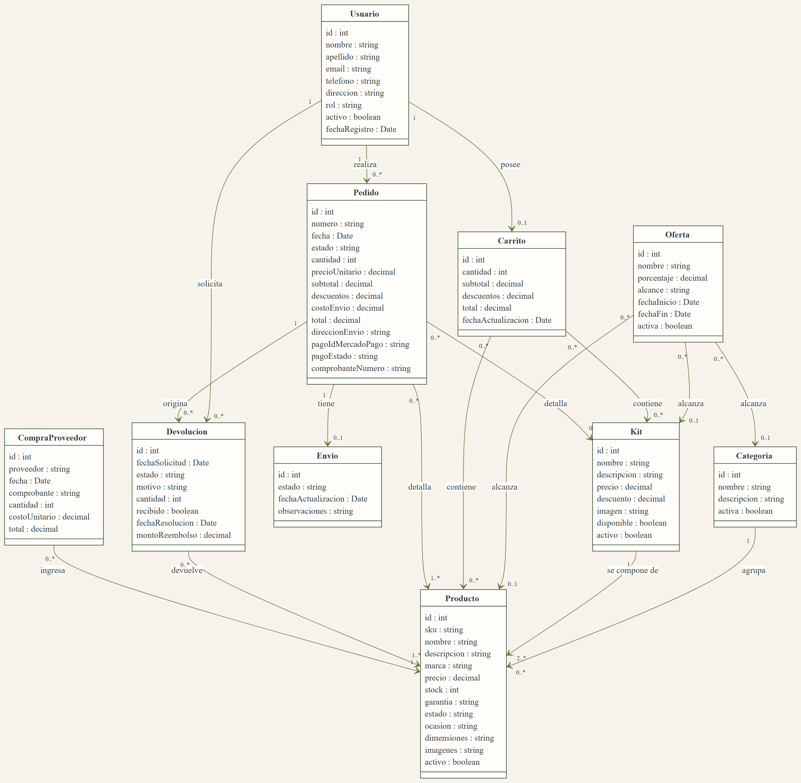
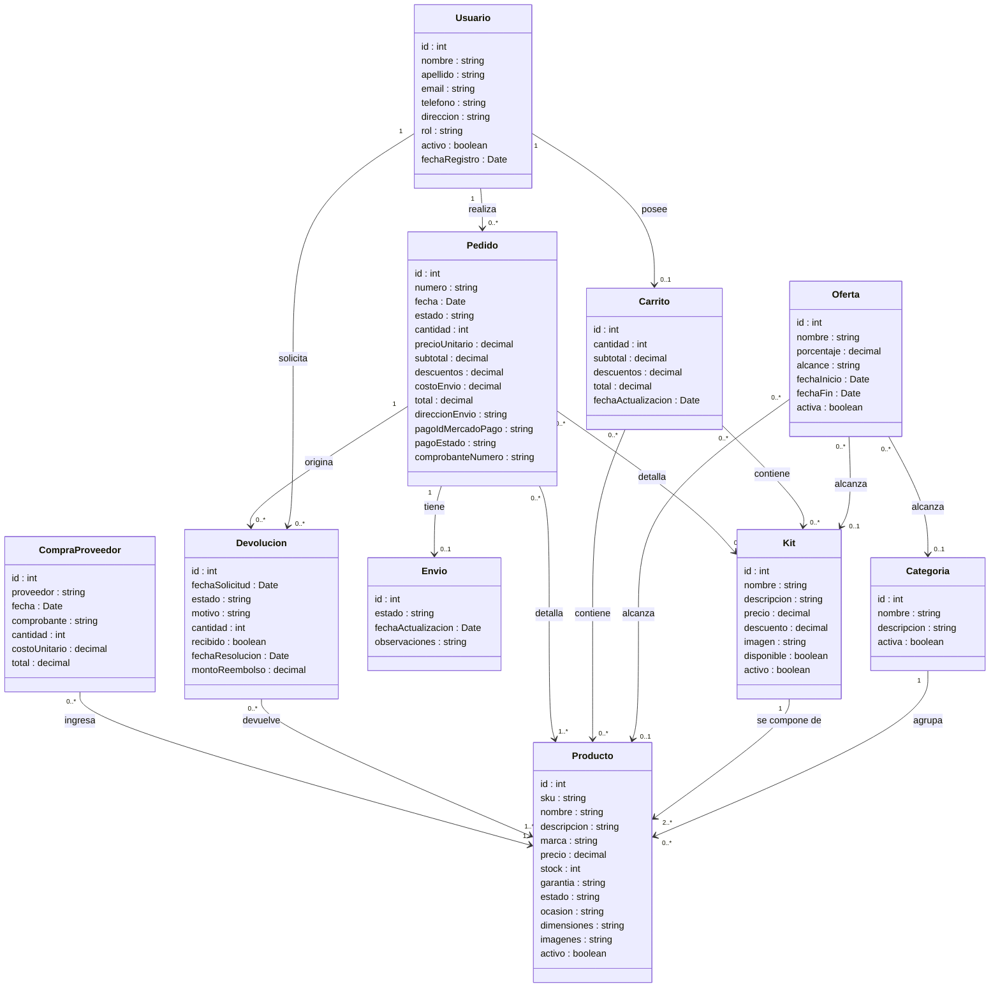

# Aventura 360 — Diagrama de clases (entidades)

Modelo de entidades del dominio, derivado de [Aventura360-Requerimientos-v1.0.pdf](Aventura360-Requerimientos-v1.0.pdf).

Criterio: sin separar por responsabilidades, sin normalizar y solo con entidades del negocio. Los atributos compuestos quedan dentro de su clase y no se modelan clases intermedias ni de infraestructura.

---

## Diagrama

Imagen lista para el informe: [PNG](diagramas/diagrama-de-clases.png) (2890 × 2826) · [SVG](diagramas/diagrama-de-clases.svg) para imprimir o escalar sin perder nitidez. Se regeneran desde el bloque Mermaid de abajo, que es la fuente.

Fuente del diagrama

---

## Las clases

### Usuario

Un único registro para los dos métodos de acceso (RF08, UC30): el correo verificado unifica la identidad y evita cuentas duplicadas. El `rol` distingue Cliente de Administrador (RF10).

La dirección de envío queda como un atributo del usuario (RF11, UC14). Las credenciales locales no se modelan acá: al implementar, la contraseña se guarda exclusivamente como hash con salt (RNF05).

### Producto

Los atributos que exige RF14 —ID, SKU, nombre, descripción, marca, categoría, precio, garantía, estado, ocasión y dimensiones— más el stock, que gobierna la disponibilidad.

| Atributo | Descripción | Trazabilidad |
|---|---|---|
| `sku` | Código unívoco, validado al alta | RF14, UC19 |
| `stock` | Nunca puede quedar negativo | RF19, RF20 |
| `estado`, `ocasion` | Criterios de filtro y de recomendación | RF17, RF45 |
| `activo` | Baja lógica: conserva el historial | UC19 (6b) |

### Categoría

Carpas, mochilas y accesorios como mínimo (RF16). El nombre no se repite y una categoría con productos asociados no se da de baja sin reasignarlos (UC20).

### Kit

Se asocia directamente a los productos que lo integran; la cantidad de cada componente queda en la relación.

| Regla | Trazabilidad |
|---|---|
| Disponible solo si **todos** los componentes tienen stock, por la cantidad total requerida | RF22, UC29 |
| Al venderse descuenta el stock de cada componente | RF23, UC27 |
| Precio propio, distinto de la suma de sus partes | RF24, UC22 |

### Oferta

Porcentaje con vigencia que se activa y vence sola (RF27). El `alcance` dice a qué apunta —producto, categoría o kit— y solo una de las tres asociaciones queda cargada. Sobre un mismo ítem se aplica una sola oferta (UC28).

### Carrito

Funciona sin sesión iniciada y se fusiona con el del usuario al ingresar (RF01, UC04, UC06, UC07). Los precios son los vigentes al momento de la consulta, no congelados. Agregar al carrito **no reserva stock**.

### Pedido

Donde los precios se congelan (UC10). El pago y el comprobante no son clases aparte: el identificador y el estado que devuelve Mercado Pago viven como atributos, igual que la dirección copiada al confirmar.

| Estado | Cuándo | Trazabilidad |
|---|---|---|
| `pendiente_de_pago` | Generado en el checkout | UC10 |
| `pagado` | El webhook validó y la API confirmó | RF32, UC11 |
| `pago_rechazado` | Sin descuento de stock | UC11 (3a) |
| `en_revision` | La transacción de stock se revirtió | UC27 (4a) |

No se almacenan datos de tarjeta (RNF09): solo el identificador de Mercado Pago.

### Envío

Simulado: el administrador mueve el estado a mano y cada cambio notifica al cliente (RF35, UC17, UC24).

`pendiente → en preparación → en camino → entregado`

### Devolución

La solicitud no toca el stock (UC13). El reingreso ocurre cuando el administrador aprueba y se recibe la mercadería; `recibido` habilita ese reingreso y permite la devolución parcial (UC25).

`solicitada → aprobada | rechazada → reembolsada`

### CompraProveedor

La vía por la que entra stock (RF18, UC21). Cantidades nulas o negativas se rechazan.

---

## Qué quedó afuera

| No modelado | Por qué |
|---|---|
| `CuentaOAuth`, `Token`, `Sesion` | Mecanismos de autenticación; la identidad unificada se resuelve en `Usuario` |
| `Webhook`, `NotificacionPago` | Infraestructura de Mercado Pago; el resultado vive en `Pedido` |
| `LogAuditoria` | Requerimiento transversal (RNF10), no una entidad del dominio |
| `ItemCarrito`, `ItemPedido`, `ItemDevolucion`, `KitComponente` | Clases intermedias de relación; se omiten por no normalizar |
| `Direccion`, `ImagenProducto`, `Dimensiones`, `Pago`, `Comprobante` | Dentro de su clase contenedora |
| `Notificacion`, `Asistente` | El correo es externo; el asistente consulta el catálogo sin persistir entidades (UC03) |
| Fidelización, cupones, lista de deseos | Fuera del alcance (apartado 2.13) |
